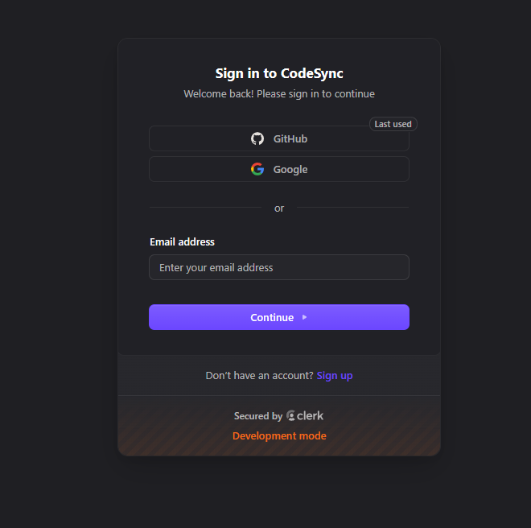
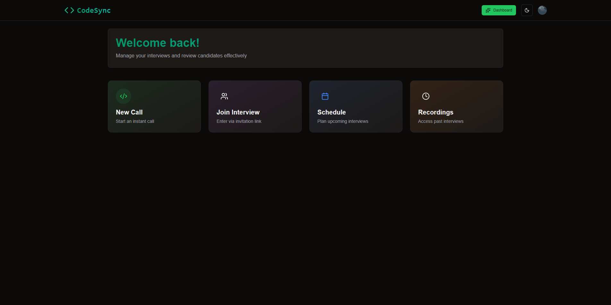
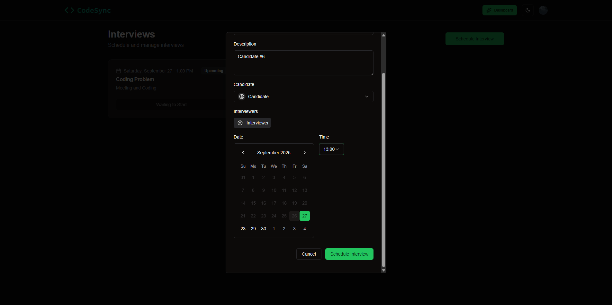
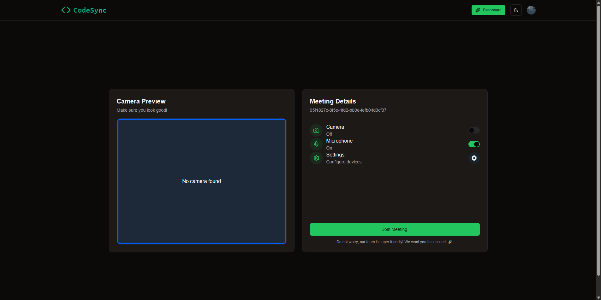
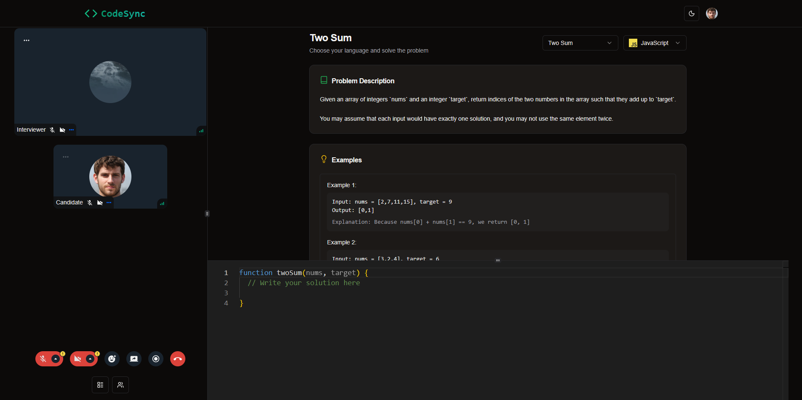
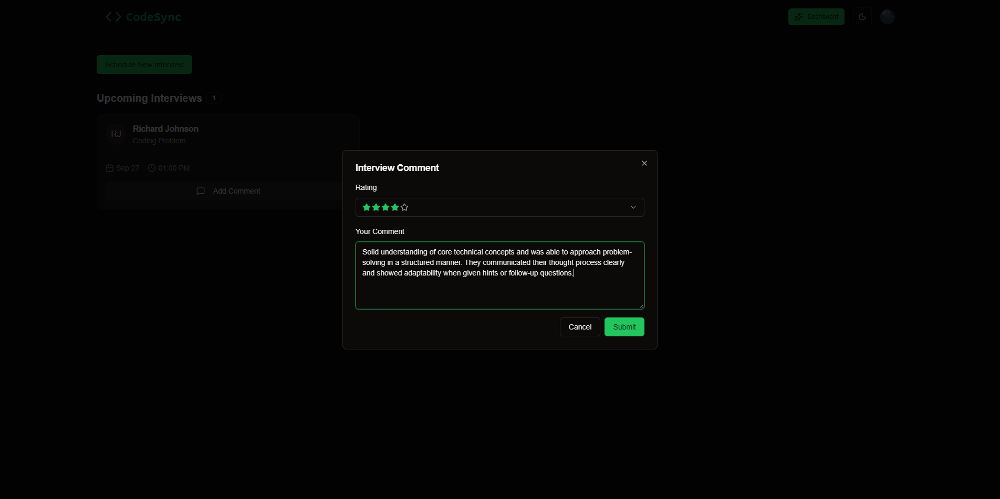
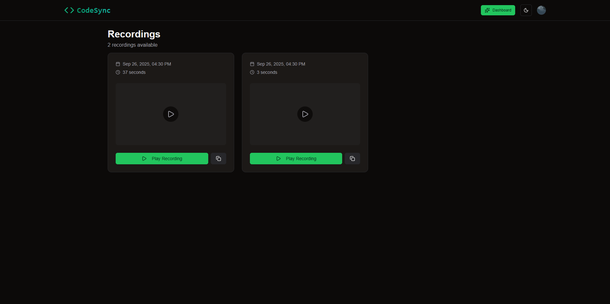
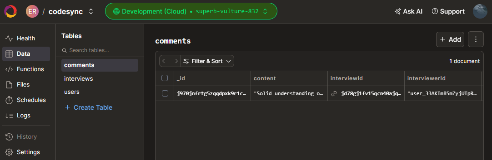
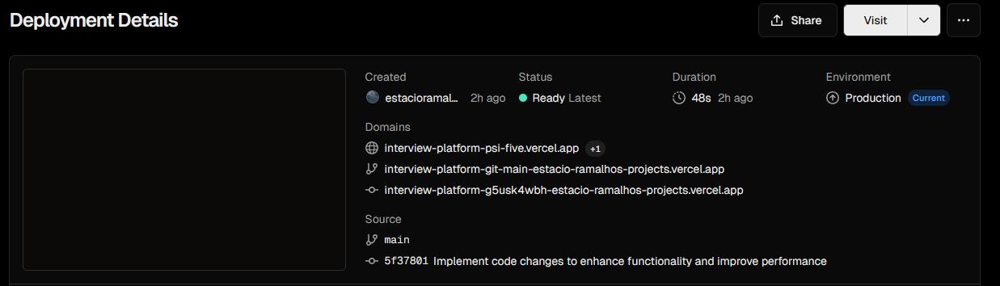

# Interview Platform 💻

A technical interview platform for scheduling interviews, live video calls, collaborative coding, comments & ratings, and recordings.

## 🧑‍💻 Tech Stack

- Language: TypeScript
- Frontend: Next.js (App Router), React, Tailwind CSS, shadcn/ui (Radix UI), next-themes, react-hot-toast, Monaco Editor
- Backend: Convex (database + functions), Clerk (auth), Stream Video (calls & recordings)
- Dev Tools: ESLint, PostCSS, Convex CLI
- Deployment: Vercel

---

## ✨ Features

- Real-Time Interviews: Live video meetings with grid/speaker layouts.
- Collaborative Code Editor: Monaco-based editor with JS/Python/Java.
- Scheduling: Plan interviews with candidates and interviewers.
- User Authentication: Secure auth via Clerk.
- Role-Based Dashboard: Manage interviews and outcomes.
- Comments & Ratings: Leave feedback after interviews.
- Recordings: View past interview recordings.
- Responsive UI: Mobile-friendly design with Tailwind CSS.
- Theme Support: Light/dark mode via next-themes.
- Toast Notifications: Instant feedback for actions.

---

## 🚀 Screenshots

**Clerk Authentication**

**Interviewer Dashboard**

**Schedule Interview**

**Interview Setup**

**Interview Room**

**Interview Comments**

**Recordings**

**Convex Database**

**Vercel Deployment**

